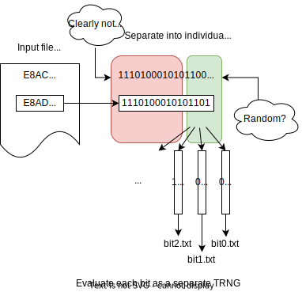
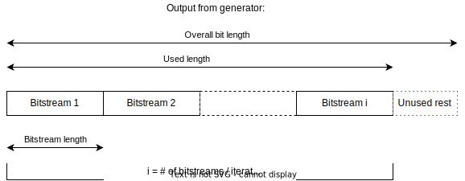

= 01. Random Number Generators

:toc:

== Linear congruential generators
LCGs were considered adequate for Monte-Carlo simulations etc. for a long time. They are however unsuitable for cryptography, as we will show.

Let us have a sequence produced by a LCG with modulus m=2^31. The sequence is {1222621274, 554244747, 695785320, 2089129857, 668008486, 1701631079, 1186464276, 1551051453, 2134702258, 1281904643}. Determine the next element.

The first example was trivial, because we knew the modulus. What if we don't know? {3981407602, 3722707486, 2838881506, 1824420908, 84969041, 3531119163, 2057414955, 3530783127, 1810314921, 3112160326} http://www.reteam.org/papers/e59.pdf

== Cryptographically secure PRNGs
Implement the Blum-Blum-Shub in Mathematica (or any other suitable SW). Try generating a sequence and then compute an element directly from its index. What is the exponent in such case? Why is it reduced modulo (p-1)(q-1)? Why does LCM(p-1,q-1) also work?

NB. For practical security, the BBS generator requires huge number sizes, which is usually impractical.

== True Random Number Generators (TRNG) HOMEWORK
A prototype TRNG based on counting eges of unstable clock generators was impemented in FPGA. Each output containts a 16 bit word corresponding to a counter value. As you can see from the recorded output, the most significant bits of the counter are pretty much constant, but in the lower bits, we can expect some randomness.

A file generated by the TRNG (ZIP archive): link:files/fpga-data.zip[FPGA DATA]

The input file is a text file containing a hexadecimal number on each line. As you can see, some bits are clearly not random, while other can be potentially random:

For each bit position, run a repeated battery of tests (e.g. a NIST STS variant). Use as many tests as reasonably possible with selected parameters (identical for all tests).

Homework for *6 points* max: Estimate the quality of the TRNG that produced the sequence above. Each row corresponds to one measurement. Consider each bit column separately: First assess the sequence of the LSB of each word (bit 0), then bit 1 etc. 

Use STS from NIST or a variant of it or another suitable testing method (if you can justify it).

Result will be a *report* of your progress -- what tests you ran, with what parameters, summary of test results and your evaluation of individual bits, (ca 1-2 pages) and *test results* (relevant outputs from the test suite).

* Points: 6
* Deadline: 2 weeks from assignment
* Submit via: GitLab repository (TBD)

[source,sh]
----
git clone https://github.com/arcetri/sts
cd sts
make
./sts -h
----

== Evaluation
For each bit position separately, evaluate the
* Pass-Fail ratio (proportion) of individual tests
* Uniformity of p-values of individual tests

Links:

* Original NIST NIST SP 800-22 Statistical Test Suite http://csrc.nist.gov/groups/ST/toolkit/rng/documentation_software.html
* Recommended for better scripting support: One of the improved versions of the NIST STS, on Github https://github.com/arcetri/sts
* helper program to separate a selected bit: link:files/extract.c[]
* Submit via GitLab, create folder named **TRNG** in:
** https://gitlab.fit.cvut.cz/NI-KRY/B231/en / your username (English group)
** https://gitlab.fit.cvut.cz/NI-KRY/B231/cz / your username (Czech group)

== Voluntary homework for 8 points (to the end of the semester) -- Bug in Debian 2006 – 2008

This task requires a lot of hacking and digging in old programs/source codes, so be warned.

A user created his DSA key on a safe system and used it for everyday signing. Then one day he used his private key (for signing) on a Debian system with the infamous OpenSSL bug – he signed one file. It is long ago, so he forgot about it and uses his keys to this day.

You have the user's public key, the signed file and its DSA singature. Determine his private key and sign a chosen message with it.

NB. It is not the most simple case of this bug. The key would be just fine, were it not for the DSA signature.

debian_bug_assignment.zip (the problematic signature is in test.sign_leak)

Note: In current OpenSSL versions, add the option -sha1 when performing verification (default hash funciton was changed).
