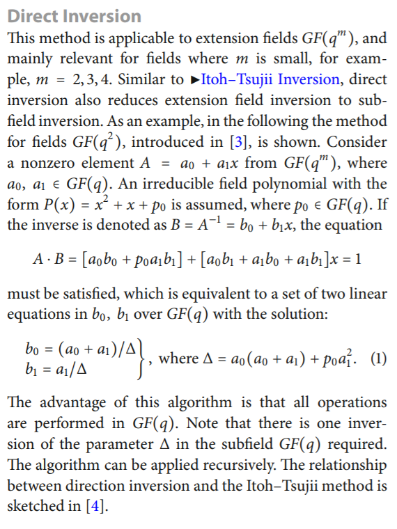

= Computing modulo numbers, multiplicative inverse

Recap of modulo computation: Seminar of the course BIE-BEZ (security) https://courses.fit.cvut.cz/BI-BEZ/en/seminars/01/index.html

Extended Euclidean algorithm for numbers: https://courses.fit.cvut.cz/BI-BEZ/media/en/seminars/01/bez-euklid-fit-en.pdf

== Computing modulo polynomials - Recap

Write the addition and multiplication tables for:

* Z2[x]/(x^2+1). Is it a field? (Czech: Je to těleso?)
* Z2[x]/(x^2+x+1). Is it a field?
* Z2[x]/(x^3+x+1). Is it a field?

== AES-like polynomials

Let us have a field F isomorphic with GF[2^2], defined as Z2[x]/(x2+x+1).
Compute the muliplicative inverse of the element x+1 (or x, ...) in F.

Consider the field of polynomials as defined in the AES standard.
Compute the multiplicative inverse of the polynomial a(x)={73} modulo m(x)={11b} (notation see AES FIPS-197 http://csrc.nist.gov/publications/fips/fips197/fips-197.pdf), i.e. b(x)=a(x)-1 mod m(x). Use the Extended Euclidean Algorithm for polynomials. 

Verify your result by multiplying back to 1 mod m(x).

// Totéž znovu - vypočtěte a(x)*b(x) mod m(x) v binární notaci pomocí operací xtime z AESu.

Copmplete the AES SBOX output computation by applying the affine transform.
You should get SBOX( {73} ) ==  {8f}.

== Computing in field extensions

Supplementary material: file:files/gf222.pdf[]

Direct inverse in extension fields by Morii, Kasahara: (see for example Christof Paar: Inversion in Finite Fields and Rings, Encyclopedia of Cryptography and Security, pp 631-632) http://link.springer.com/referenceworkentry/10.1007%2F978-1-4419-5906-5_33

Ex:

F4 = GF(2^2) = GF(2)[y]/y^2+y+1

F4^2 = F4[x]/x^2+x+y

Compute ((y+1) x + 1)^-1 in F4^2

////
Útok hrubou silou vs délka klíče
Příklad z "Understanding Cryptography", Paar, Pelzl

Máme AES s délkou klíče 192 bitů. Dále máme čip (ASIC), který umí zkontrolovat 3*10^7 klíčů za sekundu.

Použijeme-li 100000 takových čipů paralelně, jak dlouho potrvá v průměru hledání klíče? (Porovnejte tento čas se stářím vesmíru (cca 10^10 let)
Předpokládejte, že Moorův zákon bude platit pro nejbližších několik let. Kolik let budete muset počkat, dokud nebudeme moci postavit takový stroj, který najde v průměru klíč pro AES-192 za 24 hodin? Znovu uvažujte 100000 čipů paralelně.
////